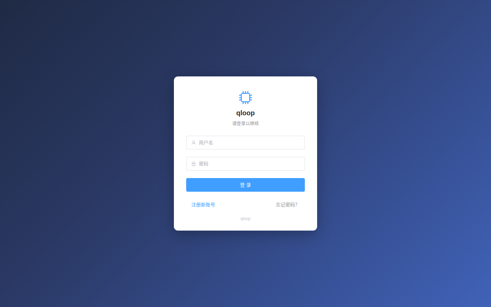
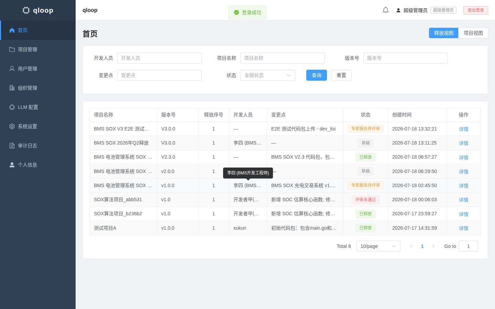
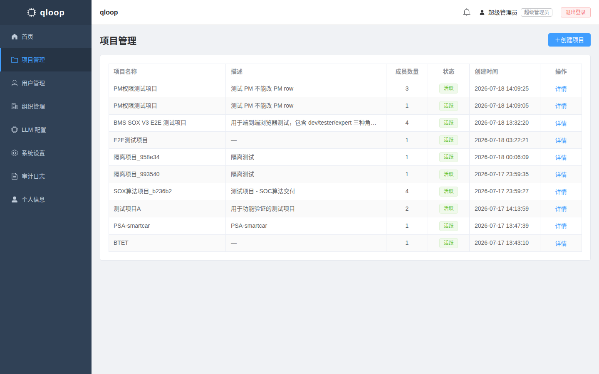
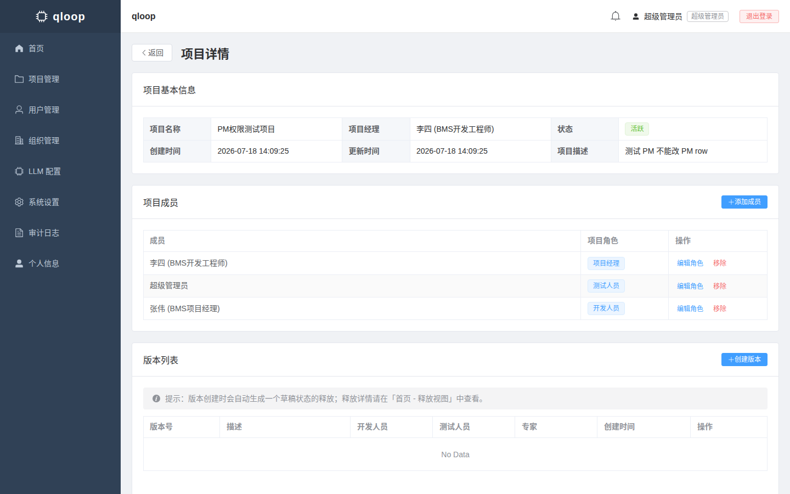
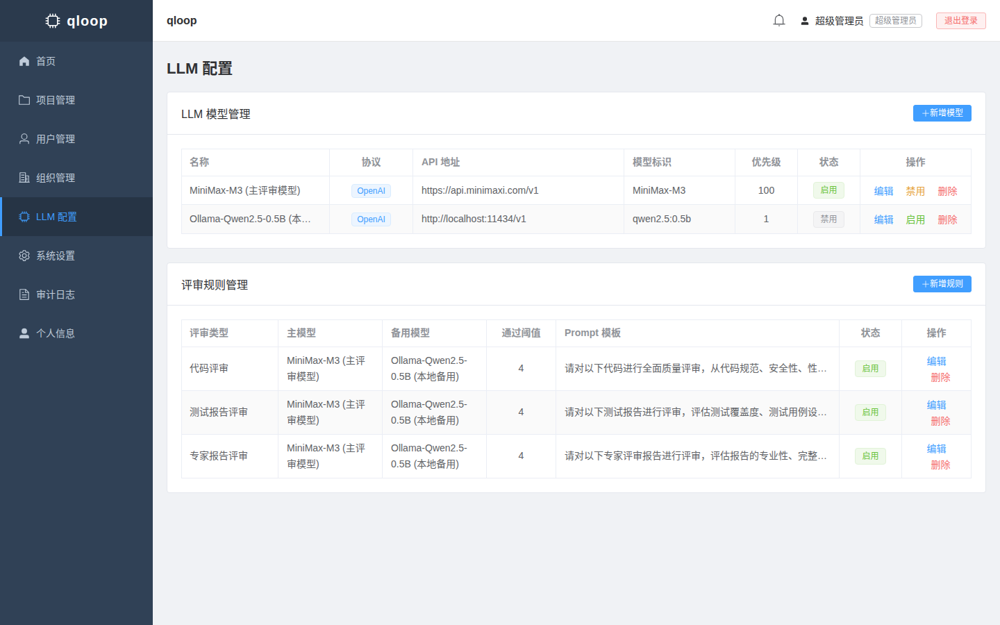
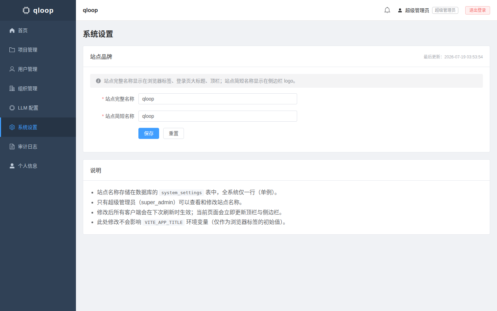
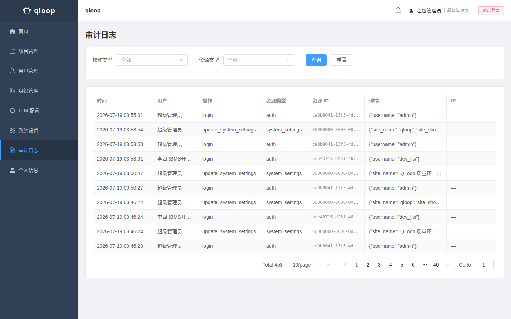
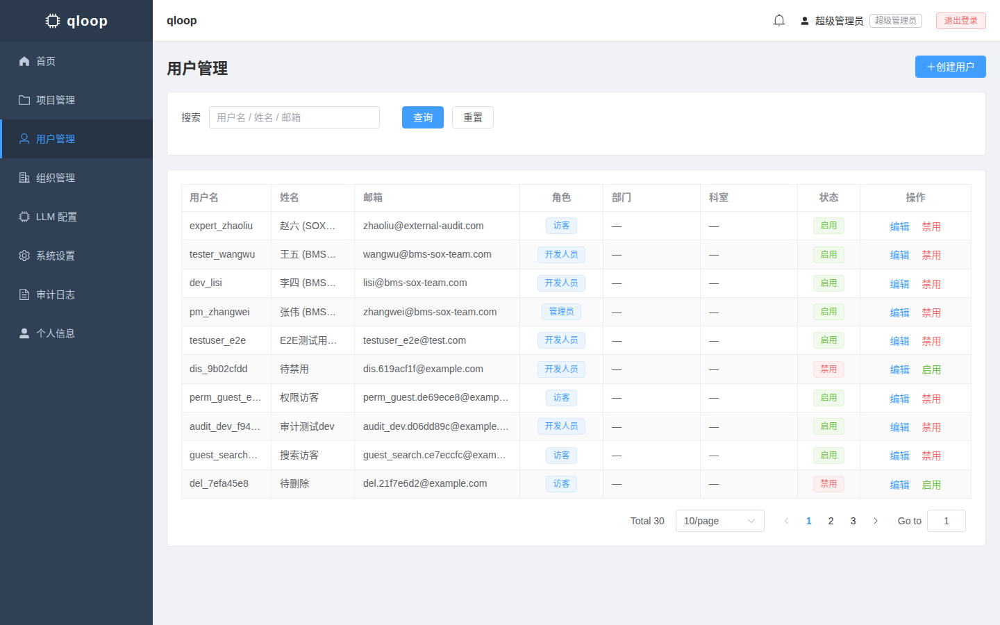

# qloop

> **Quality + Loop** — A closed-loop quality management platform for code delivery, with LLM-powered automated reviews, audit trails, and a matrix organization model.

> English | [简体中文](README_zh-CN.md)
>
> Version: 1.3.0  ·  Date: 2026-07-19

---

## Highlights

|  | Feature | What it gives a team |
|---|---|---|
|  | **7-step delivery closed loop** | From code package upload → 3× automatic LLM reviews → manual approval → external release, every step is gated and traced. |
|  | **Multi-model LLM review engine** | Plug any OpenAI-compatible or Anthropic-compatible endpoint: minimax-M3/M2.7, GLM-5.2, DeepSeek-V4-flash, Qwen, Ollama, vLLM, Claude. Automatic model fallback on failure. |
|  | **Audit trail by default** | Every privileged operation (release, role change, brand edit, LLM config) is written to an immutable audit log with actor + before/after payload. |
|  | **Matrix organization × Project roles** | Department → Section → Group hierarchy on one axis, Project → Version → Release on the other; one user can wear different hats in different projects. |
|  | **Configurable site brand** | Super admin can rename the product (top bar, sidebar logo, login page, browser tab, email signature) live from the System Settings page — no redeploy. |
|  | **Single-command Linux deploy** | One `deploy.sh` provisions PostgreSQL, Redis, MinIO, systemd units, Nginx reverse proxy, runs idempotent migrations and creates the super admin. |
|  | **File-type aware parsing** | C, Python, MATLAB `.m`, Simulink, `.mat` data, `.pth` weights; Word `.docx` and Excel `.xlsx` documents — all parsed in-house, no third-party LLM document API. |

---

## Screenshots

| Login | Home dashboard |
|:---:|:---:|
|  |  |

| Project list | Project detail |
|:---:|:---:|
|  |  |

| LLM configuration | System settings (brand) |
|:---:|:---:|
|  |  |

| Audit log | User management |
|:---:|:---:|
|  |  |

---

## Tech Roadmap

```
┌──────────────────────────────────────────────────────────────┐
│  Browser  (Vue 3 + Element Plus + Vite + Pinia + TypeScript) │
└───────────────────────────────┬──────────────────────────────┘
                                │ HTTPS  /api  +  static assets
┌───────────────────────────────▼──────────────────────────────┐
│  Nginx  (TLS termination, reverse proxy, gzip)              │
└───────────────────────────────┬──────────────────────────────┘
                                │
┌───────────────────────────────▼──────────────────────────────┐
│  FastAPI  (async, Pydantic 2, JWT auth, role-based access)   │
│  ├── Auth / Users / Projects / Releases / Reviews            │
│  ├── System Settings (singleton brand)                       │
│  ├── Audit Service (immutable operation log)                 │
│  ├── LLM Reviewer (code_parser + doc_parser + client)        │
│  └── Storage (MinIO presigned URLs, 7-day validity)          │
└─────┬──────────────────┬──────────────────┬──────────────────┘
      │                  │                  │
┌─────▼─────┐    ┌───────▼───────┐   ┌──────▼──────┐
│PostgreSQL │    │     Redis     │   │    MinIO    │
│  15+      │    │ cache + queue │   │ artifacts  │
└───────────┘    └───────┬───────┘   └────────────┘
                         │
                 ┌───────▼───────┐
                 │     Celery    │  async LLM reviews
                 │    worker     │  + email + notifications
                 └───────────────┘
```

| Layer | Stack |
|---|---|
| Frontend | Vue 3 · Element Plus · Vite · TypeScript · Pinia · Vue Router |
| Backend | FastAPI · SQLAlchemy 2.0 (async) · Pydantic 2 · python-jose (JWT) |
| Database | PostgreSQL 15+ |
| Cache / Queue | Redis 7+ |
| Object Storage | MinIO (S3-compatible, presigned URLs) |
| Async Workers | Celery |
| Web Server | Nginx (TLS, gzip, reverse proxy) |
| Process Supervisor | systemd |

### Architecture decisions worth noting

- **Idempotent migrations** — `Base.metadata.create_all` runs on every deploy; only creates missing tables, no Alembic required.
- **Singleton settings table** — `system_settings` uses a fixed UUID primary key so upsert is trivial and brand edits are atomic.
- **Storage isolation** — release artifacts are only ever streamed via 302 redirect to short-lived MinIO presigned URLs, never proxied through the API.
- **Cross-tab brand sync** — the frontend Pinia `siteInfo` store listens to a custom event + the browser `storage` event so a brand change in one tab propagates to every other open tab without a reload.

---

## Deployment

### One-command install on Linux

```bash
# 1. Clone
git clone https://github.com/fengtianyu88/qloop.git
cd qloop

# 2. Edit the configuration block at the top of deploy.sh
#    (APP_NAME, database password, MinIO keys, JWT secret, ports)
sudo vim deploy.sh

# 3. Run it
chmod +x deploy.sh
sudo ./deploy.sh                  # full install
sudo ./deploy.sh --restart        # just restart services
sudo ./deploy.sh --status         # check service health
sudo ./deploy.sh --stop           # stop everything
sudo ./deploy.sh --logs           # tail backend logs
```

What `deploy.sh` does for you, idempotently:

1. Installs system packages (`postgresql`, `redis`, `minio`, `nginx`, `python3-venv`).
2. Creates the database, MinIO bucket, and systemd units for `qloop-backend` and `qloop-celery`.
3. Builds the Vue frontend and rsyncs the artifacts to `/var/www/qloop/`.
4. Runs `Base.metadata.create_all` (only creates missing tables).
5. Creates the default super admin account.
6. Configures Nginx with the bundled `deploy/nginx_qloop.conf` and reloads.
7. Enables and starts all services.

### Default super admin

After first deploy, log in with:

```
username: admin
password: admin@2026
```

**Please change the password immediately from the user profile page.**

### Manual / non-Linux

If you cannot run `deploy.sh` (e.g. Windows dev box), follow the same logical steps manually — the [deployment guide](docs/DEPLOYMENT.md) walks through each one. The full component list:

- PostgreSQL 15+
- Redis 7+
- MinIO (or any S3-compatible storage)
- Python 3.10+ (backend)
- Node.js 18+ (frontend build)
- Nginx (or any reverse proxy)

---

## Open Protocols

qloop is built around open, vendor-neutral protocols so you can swap any layer without rewriting the application.

### LLM protocols

The `LLMProtocol` enum in [`backend/app/models/review.py`](backend/app/models/review.py) and the dual-path client in [`backend/app/llm/client.py`](backend/app/llm/client.py) implement both major inference APIs side by side:

| Protocol | Endpoint shape | Header | Tested providers |
|---|---|---|---|
| `OPENAI` | `POST {base}/chat/completions` | `Authorization: Bearer <key>` | minimax-M3, minimax-M2.7, GLM-5.2, DeepSeek-V4-flash, Qwen, vLLM, TGI, Ollama, OpenAI |
| `ANTHROPIC` | `POST {base}/v1/messages` | `x-api-key: <key>` + `anthropic-version: 2023-06-01` | Claude 3.5 / 4 series |

Adding a new model is a single INSERT into `llm_models` (or one form submit on the LLM Configuration page) — no code changes.

### Storage protocol

MinIO is fully S3-compatible. Any S3 client or gateway (AWS S3, Ceph, SeaweedFS, Rclone) can read and write the `qloop` bucket directly using the configured access keys.

### Auth protocol

Stateless JWT bearer tokens (`Authorization: Bearer <token>`), 8-hour default lifetime, refreshable from the profile page. No opaque session store, so the backend scales horizontally without sticky sessions.

### Reverse-proxy contract

The frontend talks to two well-defined URL spaces only:
- `/api/**`  — backend REST API (proxied to FastAPI on `:8000`)
- `/**` (everything else) — static frontend assets

This means you can drop qloop behind any CDN, TLS terminator, or load balancer without app-level changes.

---

## Directory Layout

```
qloop/
├── backend/
│   ├── app/
│   │   ├── api/            # FastAPI routers (auth, users, projects, releases, reviews, system_settings, ...)
│   │   ├── models/         # SQLAlchemy 2.0 ORM models
│   │   ├── schemas/        # Pydantic v2 request/response schemas
│   │   ├── services/       # Business logic (audit, system_settings, ...)
│   │   ├── llm/            # LLM review engine (code_parser, doc_parser, client, reviewer, prompts)
│   │   ├── tasks/          # Celery async tasks
│   │   ├── storage/        # MinIO client + presigned URL helpers
│   │   ├── utils/
│   │   ├── config.py
│   │   ├── database.py
│   │   └── main.py
│   ├── .env.example
│   └── requirements.txt
├── frontend/
│   ├── src/
│   │   ├── api/            # Axios request modules
│   │   ├── components/     # Layout.vue
│   │   ├── router/
│   │   ├── stores/         # Pinia (auth, siteInfo, ...)
│   │   ├── types/
│   │   ├── views/          # Login, Home, ProjectList, ProjectDetail, ReleaseDetail,
│   │   │                   # LlmConfig, SystemSettings, AuditLog, UserManagement, ...
│   │   ├── App.vue
│   │   └── main.ts
│   ├── index.html
│   ├── package.json
│   └── vite.config.ts
├── deploy/
│   └── nginx_qloop.conf
├── docs/
│   ├── DEPLOYMENT.md
│   └── screenshots/        # Screenshots used by this README
├── deploy.sh               # One-command Linux installer
└── LICENSE
```

---

## License

[MIT](LICENSE) — fork it, ship it, brand it as your own (the brand name is configurable from the UI now, that's the whole point).
