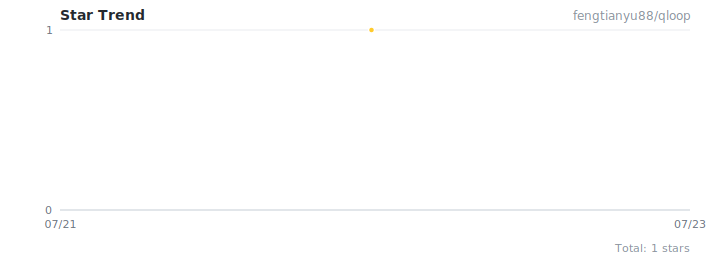

# qloop

> 让每一次交付都经得起检验的质量闭环。

[](./README_zh-CN.md)
[](./LICENSE)
[](https://www.python.org/)
[](https://vuejs.org/)
[](https://fastapi.tiangolo.com/)

> [English](README.md) | 简体中文

---

## 为什么需要 qloop?

团队里发布软件,从来不是"合并代码就能上线"这么简单。它是一条
接力链:代码评审 → 测试报告 → 专家评审 → PM 确认 → 正式释放。
每一次交接,都是问题悄悄滋生的地方。

**现有工具让你不得不用 Wiki + 群聊 + 共享盘 + 自研评审脚本拼凑流程。**
每个环节都在丢上下文,状态不清晰,谁该下一步做什么没人知道。

**qloop 把这条链路闭环。** 交付物、评审、审批、通知,统一收进一套系统,
单一事实来源,并且在每个评审关卡都接入 LLM 自动化评审。

| 没有 qloop 的痛点 | qloop 带来的改变 |
|---|---|
| "最新的代码包在哪?" | 每个交付物都有版本,按角色存入 MinIO,可下载。 |
| "评审过了吗?" | 每个关卡自动跑 LLM 评审,输出分数和建议。 |
| "下一步该谁动?" | 状态横幅直接告诉每个用户该做什么。 |
| "这个版本为什么能发?" | 全链路审计日志 + 通知流,每个事件都可追溯。 |
| "同样的代码反复人工评审。" | 多模型 LLM 评审,流式输出,自动 fallback。 |

---

## 核心特性

### 释放流水线
- **项目 → 版本 → 释放单** 三级层次
- **7 步释放流程**,内置 3 个 LLM 自动评审关卡(代码 / 测试报告 / 专家报告)
- **状态引导**:释放详情页顶部显示"下一步"横幅 — 谁该操作、做什么
- **角色化待办中心**:每个用户在首页看到属于自己的待办释放单

### LLM 评审
- **SSE 流式输出**:实时看到 LLM 思考过程 — 步骤事件(读取文件成功、LLM 连接成功)+ 逐 token 流式文字
- **多模型自动 fallback**:主模型失败 → 备用模型接管
- **任意 OpenAI 兼容后端**:minimax-M3/M2.7、GLM-5.2、Deepseek-V4-flash、Qwen、Ollama、vLLM、TGI — 开箱即用
- **结构化 JSON 输出**:分维度评分、总分、结论、改进建议

### 交付物解析
- **代码包**:C、Python、MATLAB `.m`、Simulink 模型、`.mat` 数据、`.pth` 权重
- **文档**:Word (`.docx`)、Excel (`.xlsx`)、纯文本 (`.md`/`.txt`/`.csv`/`.json`/`.yaml`)
- **ZIP 压缩包**:自动解压 + 递归解析嵌套归档
- **模板下载**:一键下载代码包/测试报告/专家评审报告模板,自动填充项目和版本信息

### 权限与组织
- **系统角色**:访客 / 开发人员 / 管理员 / 超级管理员
- **项目角色**:项目经理 / 开发人员 / 测试人员 / 外部技术专家
- **自动加入成员**:创建版本时自动把分配的 dev/test/expert 加为项目成员
- **矩阵式组织**:流程域维度(部门 → 科室 → 小组)× 项目维度
- **完整审计日志**,记录每一次操作

### 通知
- **应用内通知 + 邮件提醒**
- **关键事件自动触发**:版本分配、交付物上传、评审通过/失败、释放确认
- **通知去重**(v1.4.7):SSE 重连不再重放已弹过的通知

---

## 架构图

```
┌──────────────────────────────────────────────────────────────────┐
│                         浏览器 (Vue 3 SPA)                        │
│  Element Plus · Pinia · Vite · TypeScript · SSE EventSource      │
└──────────────────────────────┬───────────────────────────────────┘
                               │ HTTPS / SSE
┌──────────────────────────────▼───────────────────────────────────┐
│                     Nginx (反向代理)                              │
└──────────────────────────────┬───────────────────────────────────┘
                               │
┌──────────────────────────────▼───────────────────────────────────┐
│                     FastAPI (异步, JWT 鉴权)                     │
│  ┌─────────────┐  ┌──────────────┐  ┌────────────────────────┐   │
│  │ API 路由    │  │  服务层       │  │  LLM 评审引擎            │   │
│  │ auth/users/ │  │  audit ·     │  │  code_parser ·          │   │
│  │ projects/   │  │  permission  │  │  doc_parser ·           │   │
│  │ releases/   │  │  release     │  │  client (流式) ·         │   │
│  │ reviews     │  │  notification│  │  reviewer               │   │
│  └─────────────┘  └──────────────┘  └────────────────────────┘   │
└───────┬──────────────────┬───────────────────┬───────────────────┘
        │                  │                   │
   ┌────▼─────┐      ┌─────▼─────┐       ┌─────▼──────┐
   │PostgreSQL│      │   Redis   │       │   MinIO    │
   │  15+     │      │ 缓存 +    │       │ 交付物     │
   │ 元数据   │      │  pub/sub  │       │ (代码包/   │
   │ 审计     │      │  channel  │       │  报告)     │
   └──────────┘      └─────┬─────┘       └────────────┘
                           │
                  ┌────────▼─────────┐
                  │  Celery worker   │
                  │  · LLM 评审       │
                  │  · 邮件          │
                  │  · 通知          │
                  └────────┬─────────┘
                           │ progress_callback
                           │ → Redis publish
                           │ → SSE 端点
                           │ → 浏览器流式接收
                           ▼
                  ┌──────────────────┐
                  │  LLM 后端        │
                  │  (OpenAI 兼容)   │
                  └──────────────────┘
```

---

## 技术栈

| 层级 | 技术 |
|-------|------------|
| 前端 | Vue 3 · Element Plus · Vite · TypeScript · Pinia |
| 后端 | FastAPI · SQLAlchemy 2.0 (异步) · Pydantic 2 |
| 数据库 | PostgreSQL 15+ |
| 缓存 / 队列 | Redis 7+ (缓存 + pub/sub 用于 SSE) |
| 对象存储 | MinIO |
| 异步任务 | Celery |
| LLM 评审 | httpx 异步流式 · 任意 OpenAI 兼容 API |
| 鉴权 | JWT (python-jose) |

---

## 快速开始

完整部署步骤请阅读 **[部署指南](docs/DEPLOYMENT.md)**(Linux + Windows)。

### 简要步骤

1. **安装依赖**:PostgreSQL、Redis、MinIO
2. **配置后端**:复制 `backend/.env.example` → `backend/.env`,填入数据库 / Redis / MinIO / LLM 配置
3. **安装 Python 依赖**:`pip install -r backend/requirements.txt`
4. **初始化数据库**:执行建表脚本(见部署指南)
5. **创建超级管理员**:执行初始化脚本(见部署指南)
6. **启动后端**:`uvicorn app.main:app --host 0.0.0.0 --port 8000`
7. **启动 Celery worker**:`celery -A app.tasks.celery_app worker --loglevel=info`
8. **构建前端**:`cd frontend && npm install && npm run build`
9. **配置 Nginx**:托管前端构建产物,反向代理 `/api` → 后端

---

## 目录结构

```
qloop/
├── backend/                 # 后端 FastAPI 应用
│   ├── app/
│   │   ├── api/             # API 路由 (auth, users, projects, releases, reviews)
│   │   ├── models/          # 数据库模型 (User, Project, Release, LLMReview, ...)
│   │   ├── schemas/         # Pydantic 请求/响应模型
│   │   ├── services/        # 业务逻辑层 (audit, permission, release, ...)
│   │   ├── llm/             # LLM 评审引擎 (code_parser, doc_parser, client, reviewer)
│   │   ├── tasks/           # Celery 异步任务 (LLM 评审, 邮件, 通知)
│   │   ├── storage/         # MinIO 文件存储
│   │   ├── utils/           # 工具 (security, pagination)
│   │   ├── config.py        # 配置管理
│   │   ├── database.py      # 数据库连接
│   │   └── main.py          # 应用入口
│   ├── .env.example         # 环境变量模板
│   └── requirements.txt     # Python 依赖
├── frontend/                # 前端 Vue 3 应用
│   ├── src/
│   │   ├── api/             # API 请求模块
│   │   ├── components/      # 共享组件 (Layout)
│   │   ├── router/          # 路由配置
│   │   ├── stores/          # Pinia 状态管理
│   │   ├── types/           # TypeScript 类型定义
│   │   ├── views/           # 页面组件
│   │   ├── App.vue          # 根组件
│   │   └── main.ts          # 应用入口
│   ├── index.html
│   ├── package.json
│   ├── vite.config.ts
│   └── tsconfig.json
└── docs/                    # 文档
    ├── DEPLOYMENT.md                     # 部署指南 (Linux + Windows)
    └── superpowers/
        ├── specs/                        # 设计文档
        └── plans/                        # 实现计划
```

---

## 文档

- **[部署指南](docs/DEPLOYMENT.md)** — Linux & Windows 完整部署步骤
- **[设计文档 v1.4.7](docs/superpowers/specs/2026-07-22-qloop-design-v1.4.7.md)** — 覆盖 v1.4.0 → v1.4.7 的增量设计说明

---

## 默认管理员

首次部署后,使用以下账号登录:

- 用户名:`admin`
- 密码:`admin123`

**首次登录后请立即修改密码!**

---

## 关于名称

**qloop** = **Q**uality + **Loop**。把"质量"和"闭环"融合在一起,
寓意测试在开发过程中不断循环、持续打磨,不留死角。
五个字母,极短,抽象,现代。

---

## 许可证

本项目基于 [MIT 许可证](LICENSE) 开源。任何使用(包括商业用途)均允许,
但需保留版权声明。

Copyright (c) 2026 fengtianyu88


---

## 星标趋势



> 根据 GitHub stargazers 数据自动生成。重新运行 `gen_star_trend.py` 可刷新。
